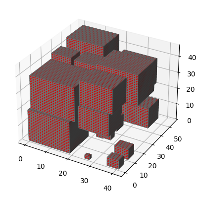

🧠 Genetic Algorithm for 3D Bin Packing Problem
This project implements a Genetic Algorithm to solve the 3D Bin Packing Problem with 20 cubes of varying sizes. Each cube has a unique size ranging from 1 to 20 units, and the goal is to minimize the bounding box volume that contains all the cubes without overlapping.

🧑‍🎓 This project was developed as part of the "Optimization Algorithms in Engineering" course during my Master’s studies in School of Electrical Engineer.


📌 Problem Statement
The 3D Bin Packing Problem involves placing 20 cubes of different sizes into the smallest possible volume such that:

* Cubes do not overlap
* All sides are aligned to the main coordinate axes
* The algorithm optimizes packing to minimize wasted space

⚙️ Algorithm Details
The solution is based on a Genetic Algorithm (GA) with the following components:

* Encoding: Each individual is a dictionary mapping cube size → (x, y, z) position

*Selection: Roulette wheel selection based on fitness (inverse of used volume)

* Crossover: Combining spatial arrangements from two parents, with collision checks

* Mutation: Random repositioning of one cube if it results in valid placement

Fitness Function:
```python

Fitness = 1 / (Volume of bounding box - volume of biggest box)
```

📊 Results: Example Packing Result After 1000 Iterations
The image below shows the final arrangement of 20 cubes in 3D space after running the genetic algorithm for 1000 generations. The cubes are packed without overlaps, and the volume of the bounding box is minimized.

